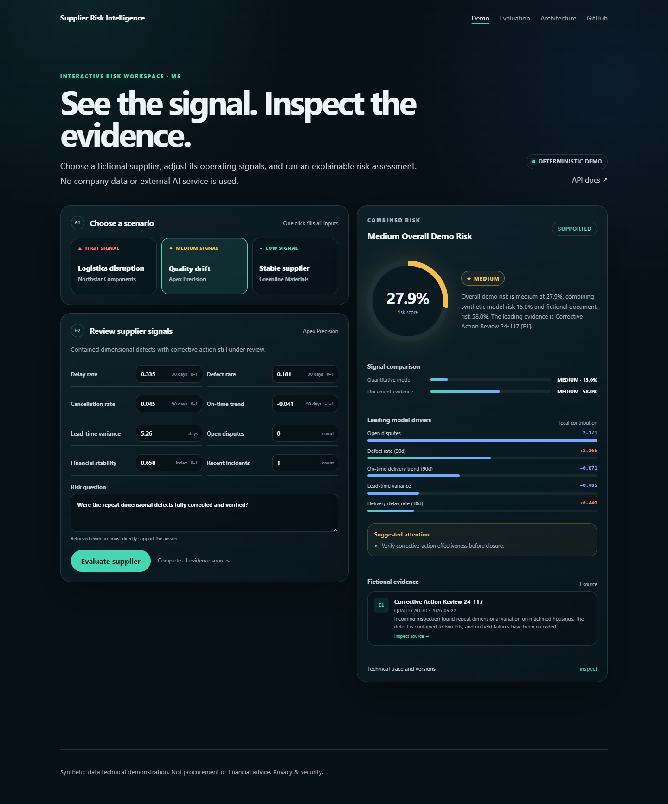
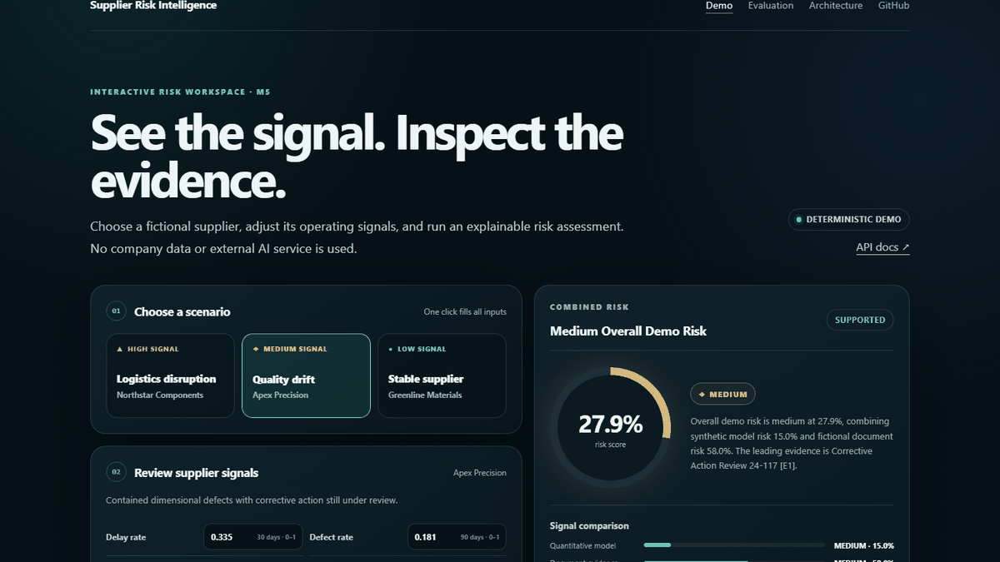
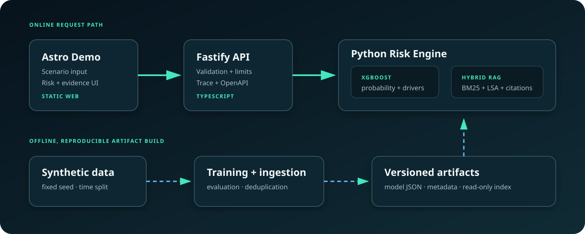

# Supplier Risk Intelligence

[](../../actions/workflows/ci.yml)
[](LICENSE)
[](docs/08_DEPLOYMENT_TROUBLESHOOTING.md)

An explainable supplier-risk portfolio demo that combines an XGBoost risk model, hybrid evidence retrieval and a citation-bound decision workflow. It is intentionally built without employer data, paid AI APIs or hidden external services.



<details>
<summary>View the short interaction walkthrough</summary>



</details>

## What the demo proves

- **End-to-end AI engineering:** Astro → Fastify → FastAPI → versioned model and retrieval artifacts.
- **Explainability:** risk probability, local XGBoost contributions, evidence cards and resolvable citations.
- **RAG discipline:** section-aware chunks, BM25 + TF-IDF/LSA ranking, deduplication, temporal weighting and explicit refusal when evidence is insufficient.
- **Production-minded boundaries:** validated contracts, request IDs, timeouts, rate and payload limits, safe errors, non-root read-only containers and automated security audits.
- **Honest evaluation:** deterministic synthetic data and fictional documents, with limitations reported beside every metric.

[Deployment guide](docs/08_DEPLOYMENT_TROUBLESHOOTING.md) · [Explore the architecture](docs/03_TECHNICAL_ARCHITECTURE.md) · [Read the development walkthrough](docs/04_DEVELOPMENT_WALKTHROUGH.md)

## Architecture



The public API validates and traces each request, then delegates model inference and retrieval to one Python boundary. XGBoost and hybrid retrieval run in parallel; a versioned 70/30 policy fuses the two signals. A deterministic evidence-bound summary cites only evidence returned in the same response. If retrieval is insufficient, the system returns `MODEL_ONLY` and never treats missing evidence as low risk.

## Try it locally

### Docker Compose — recommended

Requirements: Docker Desktop with Compose v2, Git, and roughly 4 GB of free memory.

```bash
git clone <repository-url>
cd supplier-risk-intelligence
docker compose up --build
```

Open [http://localhost:8080/demo/](http://localhost:8080/demo/). The first image build can take several minutes; later starts reuse cached layers. API documentation is at [http://localhost:3100/docs/](http://localhost:3100/docs/).

Check the running services:

```bash
curl http://localhost:3100/ready
curl http://localhost:8000/ready
```

Stop the demo with `docker compose down`. No database or cloud credential is required.

### Native development

Requirements: Node.js 24+, pnpm 11.9+, Python 3.12+ and Git.

```bash
pnpm install
pnpm bootstrap:risk
pnpm dev
```

Open `http://localhost:4321/demo/`. Native API docs are at `http://localhost:3000/docs/`.

## Verification

```bash
python -m pipelines.verify_artifacts
python -m pipelines.verify_retrieval_artifacts
pnpm verify
docker compose config --quiet
```

The CI workflow independently runs Node and Python audits, formatting, linting, type checks, unit and integration tests, artifact checks, retrieval regression, secret scanning, builds and Compose validation.

## Measured results

| Evaluation               |          Result | Interpretation                                                                |
| ------------------------ | --------------: | ----------------------------------------------------------------------------- |
| High-risk recall         |          0.8919 | 33 of 37 positives found in the untouched 2025 synthetic test period          |
| Precision                |          0.3235 | Expected trade-off from recall-oriented threshold selection at ~2% prevalence |
| PR-AUC                   |          0.6530 | More informative than accuracy for the imbalanced synthetic target            |
| Retrieval Recall@5 / MRR | 1.0000 / 1.0000 | All eight curated fictional queries pass; not an open-domain claim            |
| Local API client P95     |        34.08 ms | Warm, sequential Docker regression baseline; not a capacity claim             |

See [Evaluation](docs/06_EVALUATION.md) for dataset boundaries, methodology and reproducible commands.

## Repository map

```text
apps/web/                 Astro interface and browser QA
apps/api/                 Fastify orchestration API and OpenAPI
services/risk-engine/     FastAPI model + retrieval runtime
packages/api-schema/      Shared request/response contracts
pipelines/                Data, training, retrieval, audit and benchmark jobs
models/ and indexes/      Versioned public-demo artifacts
data/                     Synthetic samples and fictional documents
docs/                     Product, architecture, security and engineering record
render.yaml               Hosted-demo infrastructure blueprint
```

## Documentation

- [Product requirements](docs/01_PRD.md)
- [Development plan](docs/02_DEVELOPMENT_PLAN.md)
- [Technical architecture](docs/03_TECHNICAL_ARCHITECTURE.md)
- [Development walkthrough](docs/04_DEVELOPMENT_WALKTHROUGH.md)
- [Security and privacy](docs/05_SECURITY_PRIVACY.md)
- [Evaluation](docs/06_EVALUATION.md)
- [Known limitations](docs/07_LIMITATIONS.md)
- [Deployment and troubleshooting](docs/08_DEPLOYMENT_TROUBLESHOOTING.md)

## Data, privacy and claims

This is a portfolio reference implementation, not a production supplier decision system. It contains no employer data, source code, documents or model artifacts. The model uses 12,000 deterministic synthetic snapshots; retrieval uses entirely fictional supplier documents. Do not submit personal, confidential or commercially sensitive information to the public demo.

Released under the [MIT License](LICENSE).
