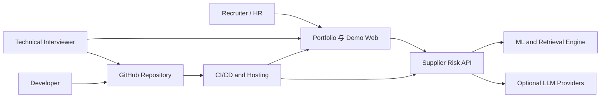
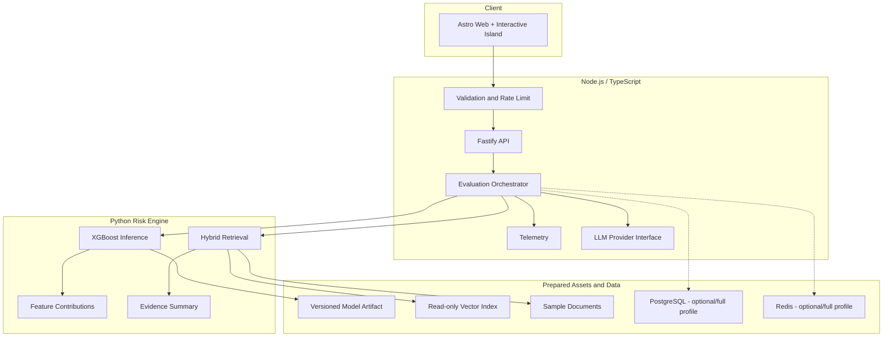
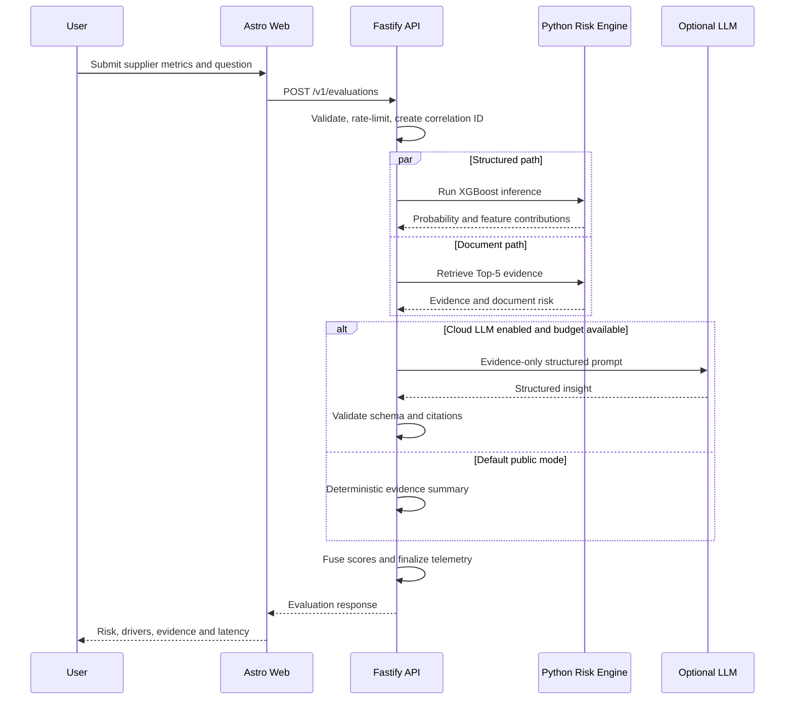
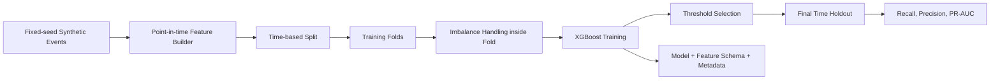
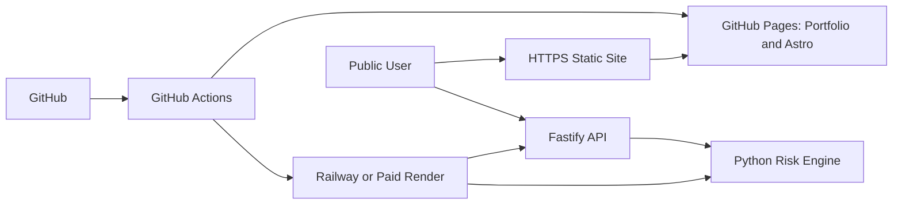

# Supplier Risk Intelligence Platform Demo - 技术架构

## 1. 文档目的

本文定义公开 Demo 的系统边界、组件职责、数据流、接口、部署方式和工程约束。目标是在保持简历技术叙述一致性的同时，控制公开演示的成本、安全风险和运维复杂度。

## 2. 架构原则

1. 在线请求不进行模型训练、文档 OCR 或批量 Embedding。
2. 模型、语料和向量索引在构建或离线任务中准备。
3. RAG 回答必须由当前响应中的 Evidence 支撑。
4. TypeScript 负责公共 API、编排和平台能力；Python 负责 ML 和 Retrieval。
5. 公共 Demo 默认使用确定性 Summary，真实 LLM 为可选增强。
6. 开发和完整架构可以使用多个数据服务；公开托管允许精简但必须记录差异。
7. 每个请求使用 Correlation ID，并记录阶段级耗时。

## 3. 系统上下文



## 4. 容器级架构



## 5. 组件职责

### 5.1 Astro Web

职责：

- 展示项目背景和交互式 Demo。
- 收集结构化特征和风险问题。
- 显示风险分数、解释、证据和遥测。
- 提供 Architecture、Evaluation、Privacy 和 GitHub 入口。

约束：

- 主要页面静态生成。
- 只有 Demo 表单和图表使用客户端 JavaScript。
- 不包含任何服务端 Secret。
- 前端校验只改善体验，服务端仍进行完整校验。

### 5.2 Fastify API

职责：

- 暴露公共 HTTP API。
- JSON Schema 校验和统一错误响应。
- 限流、CORS、Payload 限制和超时。
- 生成或透传 Correlation ID。
- 编排 Python Risk Engine 和可选 LLM Provider。
- 执行结果 Schema、Citation 和融合结果校验。
- 输出阶段级 Telemetry。

Fastify 不负责：

- 模型训练。
- 文档 OCR。
- 大批量 Embedding。
- 直接暴露 Provider Secret。

### 5.3 Python Risk Engine

职责：

- 加载版本化 XGBoost 模型。
- 执行特征转换和推理。
- 返回特征贡献。
- 执行 Query Embedding 和 Hybrid Retrieval。
- 返回带 Metadata 的 Top-K Evidence。
- 生成默认的 Evidence-bound Summary。

启动时行为：

- 校验模型和特征 Schema 版本。
- 加载模型到内存。
- 加载只读索引和文档 Metadata。
- 运行轻量自检。

### 5.4 Offline Pipeline

职责：

- 生成合成数据。
- 训练和评估模型。
- 清理、去重和分块文档。
- 批量生成 Embedding。
- 构建向量索引。
- 运行 Retrieval Regression。
- 产生版本化 Metadata 和报告。

该 Pipeline 不在公共请求路径运行。

## 6. 在线评估时序



## 7. 离线 ML Pipeline



### 防止数据泄漏

- 每条特征都带 `as_of_time`。
- 标签窗口发生在预测时间之后。
- 训练、验证和最终测试按时间切分。
- SMOTE 或任何采样只在训练 Fold 内执行。
- 标准化、缺失值规则和类别编码只在训练数据拟合。

M2 的实际实现使用 2019–2023 训练、2024 验证和 2025 最终测试。类别不平衡通过仅由训练期标签计算的 `scale_pos_weight` 处理，不生成合成少数类样本。

### 模型输出

```json
{
  "modelVersion": "srm-xgb-demo-1.0.0",
  "riskProbability": 0.82,
  "riskBand": "HIGH",
  "thresholds": {
    "medium": 0.099167,
    "high": 0.220371
  },
  "drivers": [
    {
      "feature": "delivery_delay_rate_30d",
      "value": 0.27,
      "contribution": 0.18,
      "direction": "INCREASES_RISK"
    }
  ]
}
```

M2 使用 XGBoost `pred_contribs` 产生局部特征贡献。贡献值位于模型的 margin/log-odds 空间，接口用其绝对值排序、用正负号表达风险方向；它不是概率百分点。

## 8. 文档 Ingestion 与 RAG

### 8.1 离线流程

```mermaid
flowchart LR
    RAW["Fictional Structured Documents"] --> EXT["Section Extraction + Validation"]
    EXT --> CLEAN["Clean and PII Rules"]
    CLEAN --> HASH["Exact Hash Dedup"]
    HASH --> CAND["Supplier + Type + Time Buckets"]
    CAND --> NEAR["Near-duplicate Detection"]
    NEAR --> CHUNK["Semantic Chunking"]
    CHUNK --> EMB["Local Embedding"]
    EMB --> NORM["L2 Normalization"]
    NORM --> IDX["Vector Index + Metadata"]
```



### 8.2 Hybrid Ranking

概念公式：

```text
finalScore =
    denseCosine      * 0.45
  + normalizedBM25   * 0.35
  + domainAnchor     * 0.10
  + sourceQuality    * 0.06
  + temporalDecay    * 0.04
```

权重必须：

- 存储在版本化配置中。
- 通过标注查询集调优。
- 在评估报告中公开。
- 避免 Freshness 完全压过高度相关的旧证据。

### 8.3 Temporal Decay

M3 使用 730 天统一 Half-life，防止小型语料中的新鲜度信号压过文本相关性。按文档类型配置不同 Half-life 保留为后续扩展，不在当前 Demo 中伪装成已实现能力。

M3 Public Profile 不下载 Sentence-Transformers 模型。离线构建使用 word/bigram TF-IDF 与固定随机种子的 Truncated SVD 生成 16 维 LSA 稠密向量，再执行 L2 normalization。该方案比预训练语义模型能力有限，但构建确定、镜像较小、无需外部模型服务；Full Profile 可替换为 Sentence-Transformers 与 Milvus，而不改变 Citation Contract。

### 8.4 Citation Contract

每条 Evidence 至少包含：

```json
{
  "citationId": "E1",
  "documentId": "NSC-LOG-2026-06",
  "title": "June Logistics Exception Bulletin",
  "supplierName": "Northstar Components",
  "sourceType": "LOGISTICS_BULLETIN",
  "publishedAt": "2026-06-18",
  "section": "Ocean freight",
  "excerpt": "Three priority component shipments missed their booked sailings...",
  "score": 0.91,
  "riskCategory": "LOGISTICS",
  "severity": 0.91
}
```

任何 Insight 引用的 `citationId` 都必须存在于当前响应的 Evidence 数组中。

## 9. LLM 编排

### 9.1 Provider Interface

```ts
interface InsightProvider {
  readonly name: string;
  generate(input: EvidenceBoundPrompt, signal: AbortSignal): Promise<Insight>;
  health(): Promise<ProviderHealth>;
}
```

候选实现：

- OpenAI Provider。
- DeepSeek Provider。
- Local Ollama Provider，仅本地或资源允许的环境。
- Deterministic Provider，公共 Demo 默认 fallback。

### 9.2 超时和 Circuit Breaker

不能只使用 `Promise.race`。实现至少需要：

- `AbortController` 取消 HTTP 请求。
- 连续失败计数。
- Closed、Open、Half-open 状态。
- Open 冷却期。
- Half-open 探测。
- Provider 恢复逻辑。
- 稳定 Task ID 防止重复写入。

MVP 的公共默认路径不依赖 Cloud LLM，因此 Provider 编排属于 P1；接口和错误模型在 P0 预留。

## 10. 风险融合

MVP 默认：

```text
combinedRisk = structuredRisk * 0.70 + documentRisk * 0.30
```

约束：

- 权重通过配置加载。
- UI 显示各分量和权重。
- 该公式明确标记为 Demo Policy。
- 无文档证据时，不应把“无证据”自动等价为“无风险”；应降低文档分量置信度并显示说明。

## 11. API 设计

### 11.1 端点

| Method | Path                  | 用途                 |
| ------ | --------------------- | -------------------- |
| GET    | `/health`             | Liveness             |
| GET    | `/ready`              | 模型和索引 Readiness |
| GET    | `/version`            | 应用、模型和索引版本 |
| GET    | `/v1/scenarios`       | 预置供应商场景       |
| POST   | `/v1/evaluations`     | 执行风险评估         |
| GET    | `/v1/evaluations/:id` | P1：读取短期缓存结果 |
| GET    | `/docs`               | OpenAPI UI           |

### 11.2 请求示例

```json
{
  "scenarioId": "high-risk-logistics",
  "supplierMetrics": {
    "deliveryDelayRate30d": 0.27,
    "defectRate90d": 0.08,
    "cancellationRate90d": 0.05,
    "leadTimeVarianceDays": 6.4,
    "openDisputes": 3,
    "recentIncidents": 4
  },
  "question": "Is this supplier likely to disrupt delivery in the next 14 days?"
}
```

### 11.3 响应顶层结构

```json
{
  "evaluationId": "eval_...",
  "correlationId": "corr_...",
  "createdAt": "2026-07-28T12:00:00Z",
  "risk": {},
  "quantitative": {},
  "document": {},
  "insight": {},
  "evidence": [],
  "telemetry": {},
  "disclaimer": "Synthetic-data technical demonstration only."
}
```

### 11.4 错误结构

```json
{
  "error": {
    "code": "VALIDATION_ERROR",
    "message": "One or more fields are invalid.",
    "details": [],
    "correlationId": "corr_..."
  }
}
```

## 12. 数据存储 Profile

### 12.1 Public Demo Profile

- 预构建模型随 Risk Engine 镜像发布。
- 预构建向量索引和 Metadata 以只读资产发布。
- 短期缓存使用进程内带 TTL 缓存或轻量外部缓存。
- 不持久化陌生用户输入。
- 不要求 PostgreSQL 或完整 Milvus Server。

优点：成本低、部署简单、攻击面小。

### 12.2 Full Local Profile

- PostgreSQL：场景、预计算 Insight 和评估 Metadata。
- Redis：特征缓存、结果缓存和限流状态。
- Milvus：向量和文档 Metadata。
- Ollama：本地 fallback。
- Docker Compose 一键启动。

该 Profile 用于展示生产式组件边界，不要求公共托管全部常驻。

## 13. 部署架构

### MVP 推荐



### 后续 AWS Profile

- GitHub Actions 构建镜像。
- 镜像推送到 ECR。
- ECS/Fargate 运行 API 和 Risk Engine。
- ALB 提供 HTTPS 和健康检查。
- RDS PostgreSQL、ElastiCache Redis 和外部/托管向量服务按需启用。
- Terraform 管理基础设施。

AWS Profile 是增强目标，不阻塞首次公开上线。

## 14. 可观测性

### 14.1 Correlation

- 接受合法的 `x-correlation-id`，否则生成新 ID。
- API 到 Python 和 Provider 调用全程透传。
- 响应 Header 和 Body 返回 Correlation ID。

### 14.2 结构化日志

最低字段：

- timestamp
- level
- service
- environment
- correlationId
- evaluationId
- route
- stage
- durationMs
- statusCode
- errorCode

不得记录 API Key、完整文档或未经处理的用户敏感文本。

### 14.3 Metrics

- API 请求数和错误率。
- 各阶段 P50/P95/P99。
- Model inference latency。
- Retrieval latency。
- Provider timeout/fallback。
- Cache hit rate。
- Rate-limit rejection。

## 15. 安全设计

- HTTPS only。
- 严格 CORS allowlist。
- JSON Schema allowlist，不接受未知字段。
- 请求体和问题长度限制。
- IP 限流与突发限制。
- 内部服务不直接暴露公网。
- Provider Secret 只存在服务端 Secret Store。
- 对 LLM 使用 Evidence-only Prompt 和结构化输出。
- 输出 Citation Validation。
- MVP 不执行用户提供的代码、URL 或远程下载。
- MVP 不持久化用户上传内容。
- PDF 功能启用时必须使用隔离进程、文件类型检查、页数限制和超时。

## 16. 性能与可靠性

### 性能策略

- 模型在服务启动时加载。
- 文档 Embedding 和索引离线准备。
- 结构化推理与文档检索并行执行。
- 对预置场景缓存最终结果。
- 外部 LLM 不进入默认公共关键路径。
- 响应只返回 Top-5 Evidence。

### 降级策略

1. Cloud LLM 失败：使用 Deterministic Summary。
2. Retrieval 无证据：返回无足够证据，不编造结论。
3. Risk Engine 不可用：返回服务不可用和 Correlation ID。
4. Telemetry 写入失败：不阻塞业务响应，但记录本地错误。
5. 公共托管冷启动：Web 显示初始化状态和重试操作。

## 17. 测试架构

- TypeScript：Vitest。
- Python：Pytest。
- API Contract：共享 JSON Schema 和契约测试。
- End-to-End：Playwright。
- Retrieval Regression：固定查询和 Evidence Ground Truth。
- Performance：轻量负载脚本，输出版本化报告。
- Visual QA：桌面和移动端截图检查。

## 18. 推荐仓库结构

```text
supplier-risk-intelligence-demo/
├── apps/
│   ├── web/
│   └── api/
├── services/
│   └── risk-engine/
├── packages/
│   ├── api-schema/
│   └── config/
├── pipelines/
│   ├── synthetic-data/
│   ├── training/
│   └── ingestion/
├── data/
│   ├── synthetic/
│   ├── sample-documents/
│   └── evaluation/
├── models/
├── docs/
├── infra/
│   ├── docker/
│   └── terraform/
├── tests/
├── docker-compose.yml
├── pnpm-workspace.yaml
└── README.md
```

## 19. 主要技术决策与权衡

| 决策               | 原因                                   | 代价                        |
| ------------------ | -------------------------------------- | --------------------------- |
| Astro 静态优先     | 快速、美观、SEO 和低运维               | 交互部分需单独 Island       |
| Fastify 公共 API   | 与简历技术栈一致，Schema 和性能良好    | 增加 Node/Python 两服务边界 |
| Python Risk Engine | XGBoost、SHAP 和 Embedding 生态成熟    | 需要契约和部署协调          |
| 预构建只读索引     | 降低成本和攻击面                       | 公共版不能永久保存新文档    |
| 默认确定性 Summary | 快、稳定、无 Token 滥用                | 生成能力不如 Cloud LLM 灵活 |
| Full Local Profile | 展示 PostgreSQL、Redis、Milvus、Ollama | 本地资源占用更高            |
| 时间切分评估       | 符合真实预测边界，避免未来信息泄漏     | 指标可能低于随机切分        |

## 20. 架构决策记录要求

后续发生以下情况时，应增加 ADR 或更新本文：

- 更换 Web、API 或 Risk Engine 框架。
- 更换向量存储或 Embedding 模型。
- 改变公共部署 Profile。
- 将真实 LLM 加入默认请求路径。
- 开放 PDF 上传或持久化用户数据。
- 改变风险融合策略或指标定义。
